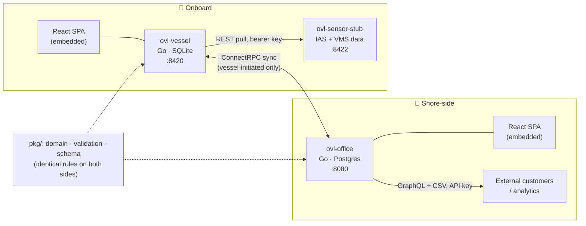
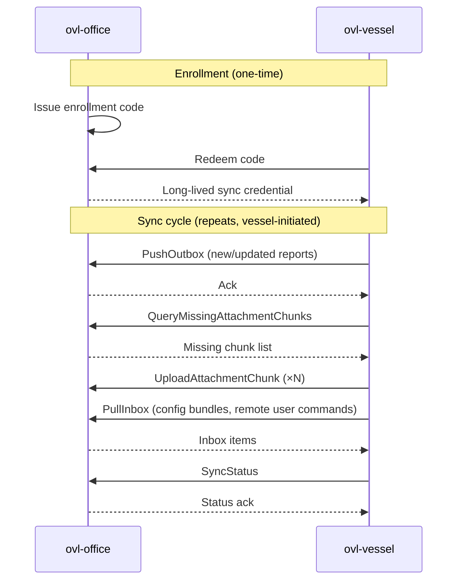
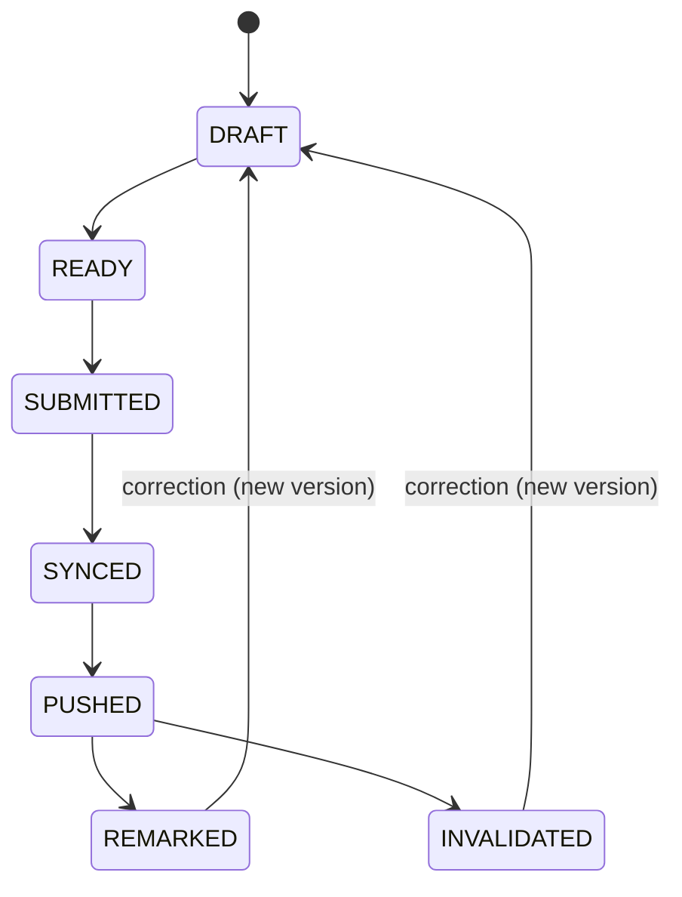

<div align="center">

# ⚓ OVL — Open Voyage Log

**An open-source vessel ⇄ office voyage reporting platform built around DNV's [Operational Vessel Data (OVD)](https://www.dnv.com/publications/operational-vessel-data-ovd-standard-246873/) standard.**

[](LICENSE)
[](go.mod)
[](web)
[](proto)
[](schemas)

</div>

---

## What is OVL?

**OVL (Open Voyage Log)** is a two-sided application for maritime voyage reporting, built against **DNV's Operational Vessel Data (OVD) standard**. It exists so that vessels can log structured voyage events — Log Abstracts, Bunker Reports, EDN Reports, Commercial Periods, Cargo Nominations — offline, at sea, and have them sync reliably back to a shore-side office once connectivity allows.

- **`ovl-vessel`** — a single, self-contained Go binary that runs onboard a ship: HTTP API, embedded React UI, local SQLite store. Works standalone with no network at all.
- **`ovl-office`** — the shore-side counterpart: fleet-wide config, review, and reporting, backed by Postgres.
- **`ovl-sensor-stub`** — a demo/dev stand-in for onboard sensor (IAS) and voyage management system (VMS) data feeds, so `ovl-vessel` can be developed and demoed without real shipboard hardware.

Both `ovl-vessel` and `ovl-office` validate reports against the **same curated OVD 3.13 JSON schemas** and run the **same validation/lifecycle logic**, so a report's health is never ambiguous depending on which side computed it.

> Searching for a DNV **OVD (Operational Vessel Data)** implementation? This is one — see [`schemas/`](schemas) for the curated OVD 3.13 schema set.

## Table of contents

- [Architecture](#architecture)
- [Components](#components)
- [Sync workflow](#sync-workflow)
- [Report lifecycle](#report-lifecycle)
- [Tech stack](#tech-stack)
- [Getting started](#getting-started)
- [Running ovl-office in production (Docker Compose)](#running-ovl-office-in-production-docker-compose)
- [Security](#security)
- [Documentation & usage](#documentation--usage)
- [License](#license)

## Architecture



`ovl-vessel` initiates every sync — the office never dials a vessel, matching how ships actually connect (intermittent satellite/cellular links). `ovl-sensor-stub` mimics whatever real onboard instrumentation would expose over the same REST contract, so a real IAS/VMS system can be swapped in without changing `ovl-vessel`.

## Components

| Path | What it is |
|---|---|
| [`vessel/`](vessel) | `ovl-vessel` — Go service: auth, report store (SQLite), sync client, sensor/VMS clients, HTTP API |
| [`office/`](office) | `ovl-office` — Go service: staff auth, enrollment, config bundles, schema versions, GraphQL/CSV export, ConnectRPC sync server (Postgres) |
| [`cmd/ovl-sensor-stub/`](cmd/ovl-sensor-stub) | Standalone binary simulating a vessel's sensor (IAS) and VMS reference-data feeds |
| [`pkg/`](pkg) | Shared libraries: report domain model, OVD schema handling, validation engine, sync protocol types, crypto, backup/restore |
| [`proto/`](proto) | The vessel⇄office `SyncService` contract (ConnectRPC/protobuf) — see [`proto/README.md`](proto/README.md) |
| [`schemas/`](schemas) | Curated OVD 3.13 JSON schemas (Log Abstract, Bunker Report, EDN Report, Commercial Period, Cargo Nomination) — see [`schemas/README.md`](schemas/README.md) |
| [`web/vessel/`](web/vessel), [`web/office/`](web/office) | React + TypeScript + Vite SPAs, built and embedded into their respective Go binaries |
| [`deploy/office/`](deploy/office) | Docker Compose stack for running `ovl-office` — see [`deploy/office/README.md`](deploy/office/README.md) |

## Sync workflow

Vessels enroll once, then run a vessel-initiated sync cycle whenever connectivity is available:



The office never initiates a connection to a vessel. The same channel also carries `FetchRestoreBundle` (disaster-recovery pull) and remote user administration commands.

## Report lifecycle



A correction is not a new lifecycle state — it's a new report version that re-enters at `DRAFT`. Because a later report in a voyage chain can depend on an earlier one, correcting an earlier report can cascade-invalidate later ones; `pkg/validation` computes this identically on both the vessel and the office.

## Tech stack

- **Go 1.26**, `CGO_ENABLED=0` throughout
- **ConnectRPC** + Protocol Buffers for the vessel⇄office sync contract
- **gqlgen** for office's read-only external GraphQL API
- **SQLite** (`modernc.org/sqlite`, pure Go) on the vessel, **Postgres** (`pgx/v5`) on the office — both migrated with `pressly/goose`
- **React + TypeScript + Vite**, embedded into each Go binary via `go:embed`
- `argon2id` password hashing, `santhosh-tekuri/jsonschema` for OVD schema validation

## Getting started

```sh
# Go binaries
make build              # go build ./...
make run-vessel          # go run ./vessel      → http://127.0.0.1:8420
make run-office           # go run ./office      → http://localhost:8080
make run-sensor-stub       # go run ./cmd/ovl-sensor-stub → http://127.0.0.1:8422

# Web frontends (npm workspaces)
make web-install
make web-dev-vessel        # Vite dev server for web/vessel
make web-dev-office         # Vite dev server for web/office

# Office needs Postgres — spin up just the database:
make compose-office-up      # docker compose -f deploy/office/docker-compose.yml up -d
```

`ovl-office` also exposes a `reset-admin-password` subcommand (`go run ./office reset-admin-password`) for recovering local staff access.

Full local-dev and Postgres setup: [`deploy/office/README.md`](deploy/office/README.md).

## Running ovl-office in production (Docker Compose)

`office/Dockerfile` builds `ovl-office` as a single distroless image (Vite build of `web/office` embedded into the Go binary). Bring up Postgres and `ovl-office` together with the Compose `full` profile:

```sh
docker compose -f deploy/office/docker-compose.yml --profile full up -d --build
```

`ovl-office` listens on `:8080` inside the Compose network. Put a TLS-terminating reverse proxy in front of it — a minimal Caddy example:

```caddyfile
office.example.com {
    reverse_proxy localhost:8080
}
```

Once TLS is in place, enable `OVL_OFFICE_SECURE_COOKIES=true` (or `-secure-cookies`) so the session cookie is marked `Secure`. Leave it off until then — a `Secure` cookie sent over plain HTTP is silently dropped by the browser, which looks like login "not sticking." The cookie is already `HttpOnly` and `SameSite=Strict` regardless.

External systems (analytics, fleet dashboards) can read synced report data without staff credentials via office's **API-key-gated, read-only GraphQL API** and CSV export (`office/apikey`, `office/graphql`) — a separate auth surface from staff sessions.

Releases: cross-compiled `ovl-vessel` binaries (linux/windows/darwin × amd64/arm64) and a signed multi-arch `ovl-office` image published to `ghcr.io/captv89/ovl-office` on every `v*` tag, via GoReleaser and cosign.

## Security

Security has been a first-class concern from the start, not bolted on:

- **Continuous scanning** — every change runs through `make security`: `govulncheck` (known-vuln dependencies), `gosec` (Go static analysis), `gitleaks` (secret scanning), and `npm audit` for both frontends.
- **Password storage** — staff and vessel-user passwords are hashed with **Argon2id** (`pkg/authcrypto`), never stored or logged in plaintext.
- **Backup/restore encryption** — disaster-recovery bundles are encrypted with **age (X25519)** (`pkg/backupcrypto`); a lost or intercepted backup file is useless without the private key.
- **Session cookies** are `HttpOnly` and `SameSite=Strict` unconditionally, with an explicit `-secure-cookies` flag to mark them `Secure` once TLS is in front — deliberately opt-in so it fails safe (cookie withheld) rather than silently insecure.
- **Minimal attack surface by design** — sync is vessel-initiated only, so `ovl-office` never opens an inbound connection to a vessel; in standalone mode `ovl-vessel` binds `127.0.0.1` only, not reachable from the network at all.
- **Separate, scoped auth surfaces** — staff sessions, vessel sync credentials, and the external GraphQL/CSV API each use independent, purpose-built credentials (bearer sync tokens, API keys) rather than one shared secret.
- **Hardened container image** — `ovl-office` ships as a `distroless/static-debian12:nonroot` image: no shell, no package manager, non-root user.
- **Signed releases** — release artifacts are checksummed and signed with **cosign** (keyless), so you can verify a release actually came from this project.
- **No CGO** (`CGO_ENABLED=0`) — both binaries, including the SQLite driver, are pure Go, avoiding a whole class of memory-safety issues from C dependencies.

## Documentation & usage

This README covers architecture and how to build/run the code. For questions about **using the application** day-to-day (vessel workflows, office administration, OVD reporting practices), get in touch via [github.com/captv89](https://github.com/captv89).

This is a solo-built project and could use more hands — on docs, testing, OVD schema coverage, or the roadmap in general. If you're interested in contributing, reach out the same way: [github.com/captv89](https://github.com/captv89).

## License

[GNU AGPL-3.0-only](LICENSE).
